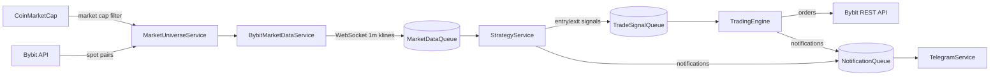

# Bybit Trading Bot

Autonomous trading bot for Bybit Spot market that monitors 300+ coins 24/7, detects impulse movements (abnormal volume + price acceleration), and executes trades with automatic position management.

> **Disclaimer**: This project is provided for educational purposes. Trading crypto assets is risky. Use testnet mode and trade at your own risk.

---

## Architecture

The bot is built as an event-driven pipeline:

```
Data Collection → Signal Detection → Execution → Maintenance → Result
```



### Services

1. **MarketUniverseService** - Manages tradeable token list
   - Fetches coins from CoinMarketCap API
   - Filters by market cap (> $1M USD)
   - Maps to Bybit spot pairs (BTC → BTCUSDT)
   - Refreshes periodically (default: hourly)

2. **BybitMarketDataService** - Real-time market data
   - REST: Fetches 5-day historical candles
   - WebSocket: Subscribes to 1m klines for all symbols
   - Updates candles every second
   - Cleans old data periodically

3. **StrategyService** - Signal detection
   - Entry: Abnormal volume + price acceleration
   - Exit: MA14 crossover (price below 14-period MA)
   - Respects risk limits and position caps

4. **TradingEngine** - Order execution
   - Executes market orders via Bybit REST API
   - Tracks order status
   - Manages position lifecycle

5. **TelegramService** - User interface
   - Notifications (signals, trades, errors)
   - Commands (/start, /status, /positions, /stats, etc.)

### Event Queues

- **MarketDataQueue**: Candle events → StrategyService
- **TradeSignalQueue**: Trade signals → TradingEngine
- **NotificationQueue**: Notifications → TelegramService

---

## Quick Start

### Prerequisites

- Python 3.12+
- PostgreSQL 16+
- Bybit API keys
- Telegram bot token

### Installation

1. Clone the repository:
```bash
git clone <repo-url>
cd ByBit_bot
```

2. Create virtual environment:
```bash
python -m venv venv
source venv/bin/activate  # Linux/Mac
# or: venv\Scripts\activate  # Windows
```

3. Install dependencies:
```bash
pip install -r requirements.txt
```

4. Configure environment:
```bash
cp .env.example .env
# Edit .env with your API keys and settings
```

5. Run the bot:
```bash
python -m src.main
```

### Docker Deployment

```bash
# Start with docker-compose (includes PostgreSQL)
docker-compose up -d

# View logs
docker-compose logs -f bot
```

---

## Configuration

All settings are in `.env` file. Key parameters:

| Variable | Description | Default |
|----------|-------------|---------|
| `BYBIT_API_KEY` | Bybit API key | - |
| `BYBIT_API_SECRET` | Bybit API secret | - |
| `BYBIT_TESTNET` | Use testnet | false |
| `TELEGRAM_BOT_TOKEN` | Telegram bot token | - |
| `MIN_MARKET_CAP_USD` | Minimum market cap filter | 1,000,000 |
| `VOLUME_SPIKE_MULTIPLIER` | Volume threshold multiplier | 1.5 |
| `MIN_PRICE_CHANGE_PCT` | Minimum price change % | 1.0 |
| `MA_EXIT_PERIOD` | MA period for exit | 14 |
| `MAX_POSITIONS` | Max simultaneous positions | 5 |
| `RISK_PER_TRADE_PCT` | Balance % per trade | 1.0 |

---

## Strategy

### Entry Conditions
1. **Volume Spike**: Current volume > `VOLUME_SPIKE_MULTIPLIER` × max(5-day volume)
2. **Price Acceleration**: (Close - Open) / Open × 100 ≥ `MIN_PRICE_CHANGE_PCT`
3. **Risk Check**: Current positions < `MAX_POSITIONS`

### Exit Conditions
1. **MA Crossover**: Price crosses below MA14

---

## Telegram Commands

| Command | Description |
|---------|-------------|
| `/start` | Register and welcome message |
| `/status` | Bot status and queue stats |
| `/positions` | List open positions |
| `/stats` | Trading statistics |
| `/setlimit <n>` | Set max positions (1-50) |
| `/help` | Available commands |

---

## Project Structure

```
ByBit_bot/
├── src/
│   ├── __init__.py
│   ├── main.py              # Entry point & orchestrator
│   ├── config/
│   │   ├── __init__.py
│   │   └── settings.py      # Configuration settings
│   ├── db/
│   │   ├── __init__.py
│   │   ├── models.py        # SQLAlchemy models
│   │   ├── database.py      # Database connection
│   │   └── repository.py    # CRUD operations
│   ├── services/
│   │   ├── __init__.py
│   │   ├── market_universe.py   # Token list management
│   │   ├── market_data.py       # WebSocket + REST data
│   │   ├── strategy.py          # Signal detection
│   │   ├── trading_engine.py    # Order execution
│   │   └── telegram_service.py  # Bot interface
│   └── queues/
│       ├── __init__.py
│       └── event_bus.py     # Event queues
├── requirements.txt
├── Dockerfile
├── docker-compose.yml
├── .env.example
└── README.md
```

---

## Development

### Running Tests
```bash
pytest
```

### Adding New Features

The architecture is designed for extension:

1. **New Signal Types**: Add detection logic to `StrategyService._check_entry_conditions()`
2. **New Exit Rules**: Add logic to `StrategyService._check_exit_conditions()`
3. **New Commands**: Add handlers in `TelegramService._register_handlers()`

---

## License

MIT License
