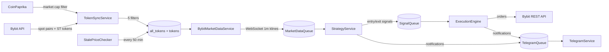

# Bybit Trading Bot

Autonomous trading bot for Bybit Spot market that monitors 300+ coins 24/7, detects impulse movements (abnormal volume + price acceleration), and executes trades with automatic position management.

> **Disclaimer**: This project is provided for educational purposes. Trading crypto assets is risky. Use testnet mode and trade at your own risk.

---

## Architecture

The bot is built as an event-driven pipeline:

```
Data Collection → Token Filtering → Signal Detection → Execution → Position Management
```



---

## Token Filtering System

### Two-Table Architecture

| Table | Purpose |
|-------|---------|
| `all_tokens` | Complete list with deactivation reasons |
| `tokens` | Only tradeable tokens (passed all filters) |

### 6 Filters Applied

| Filter | Condition | When Checked |
|--------|-----------|--------------|
| **Market Cap** | ≥ $100M USD | Daily sync |
| **Blacklist** | Manual exclusion list | Daily sync |
| **ST Tokens** | Bybit stTag/innovation flags | Daily sync |
| **LowVolume** | 24h volume ≥ $700k | Daily sync |
| **StalePrice** | <80% flat candles AND <3 consecutive flat | Every 50 min |
| **BigLoss** | Trading loss > 1% | On position close |

### Deactivation Reasons in `all_tokens`

| Reason | Description | Recovery |
|--------|-------------|----------|
| `Blacklist` | Manual blacklist | Never (manual removal) |
| `ST` | High-risk token | Never (Bybit designation) |
| `LowMcap` | Market cap < $100M | When mcap increases |
| `LowVolume` | 24h volume < $700k | Next daily sync |
| `StalePrice` | Inactive price movement | Next 50-min check |
| `BigLoss` | Loss > 1% on trade | Next daily sync (6h) |

---

## Services

### 1. TokenSyncService
- Syncs tokens from CoinPaprika + Bybit every 6 hours
- Applies 5 main filters (Market Cap, Blacklist, ST, Volume, Bybit availability)
- Updates both `all_tokens` and `tokens` tables

### 2. StalePriceChecker
- Runs every 50 minutes
- **Hybrid detection algorithm**:
  - ≥80% of candles are flat (open == close) **OR**
  - ≥3 consecutive flat candles
- Toggles `is_active` in `tokens` table

### 3. BybitMarketDataService
- REST: Fetches historical candles for bootstrap
- WebSocket: Real-time 1-minute klines
- Server time synchronization (handles clock drift)

### 4. StrategyService
- **Entry signals**: Volume spike + price acceleration + price > MA14
- **Exit signals**: Price crosses below MA14

### 5. ExecutionEngine
6 gate checks before entry:
1. Token active in database
2. No existing position for symbol
3. Max positions not reached
4. No duplicate entry this minute
5. **Price > MA14** (new)
6. Position size ≥ minimum

On position close with loss > 1%:
- Removes token from `tokens`
- Marks in `all_tokens` as `BigLoss`
- Sends Telegram notification

### 6. TelegramService
- Trade notifications (buy/sell)
- Error alerts
- Daily reports at 00:00
- Token disabled notifications

### 7. DailyReportService
- Runs at 00:00 (configurable timezone)
- Reports: orders count, P&L, win rate, active tokens

---

## Quick Start

### Prerequisites

- Python 3.12+
- PostgreSQL 16+
- Bybit API keys
- Telegram bot token

### Installation

1. Clone the repository:
```bash
git clone <repo-url>
cd ByBit_bot
```

2. Create virtual environment:
```bash
python -m venv venv
source venv/bin/activate  # Linux/Mac
# or: venv\Scripts\activate  # Windows
```

3. Install dependencies:
```bash
pip install -r requirements.txt
```

4. Configure environment:
```bash
cp .env.example .env
# Edit .env with your API keys and settings
```

5. Run the bot:
```bash
python -m core.main
```

### Docker Deployment

```bash
# Start with docker-compose (includes PostgreSQL)
docker-compose up -d

# View logs
docker-compose logs -f bot
```

---

## Configuration

All settings are in `.env` file. Key parameters:

| Variable | Description | Default |
|----------|-------------|---------|
| `BYBIT_API_KEY` | Bybit API key | - |
| `BYBIT_API_SECRET` | Bybit API secret | - |
| `BYBIT_DEMO` | Use demo/testnet | false |
| `TELEGRAM_BOT_TOKEN` | Telegram bot token | - |
| `MIN_MARKET_CAP_USD` | Minimum market cap | 100,000,000 |
| `MIN_VOLUME_24H_USD` | Minimum 24h volume | 700,000 |
| `VOLUME_SPIKE_MULTIPLIER` | Volume threshold | 1.5 |
| `MIN_PRICE_CHANGE_PCT` | Min price change % | 1.0 |
| `MA_EXIT_PERIOD` | MA period for exit | 14 |
| `MAX_POSITIONS` | Max simultaneous positions | 5 |
| `RISK_PER_TRADE_PCT` | Balance % per trade | 5.0 |
| `STALE_CHECK_INTERVAL_MIN` | Stale price check interval | 50 |
| `TOKEN_SYNC_TIME` | Daily sync time (HH:MM) | 06:00 |

---

## Strategy

### Entry Conditions (ALL must be true)
1. **Volume Spike**: Current volume > `VOLUME_SPIKE_MULTIPLIER` × baseline
2. **Price Acceleration**: Price change ≥ `MIN_PRICE_CHANGE_PCT`%
3. **Price Above MA14**: Current price > 14-period moving average
4. **Token Active**: Not filtered by any deactivation reason
5. **Risk Check**: Open positions < `MAX_POSITIONS`

### Exit Conditions
1. **MA Crossover**: Price crosses below MA14

### Risk Management
- **Position Sizing**: `RISK_PER_TRADE_PCT`% of available balance
- **BigLoss Protection**: Token disabled after >1% loss (re-enabled next sync)
- **Stale Price Protection**: Tokens with inactive prices excluded

---

## Telegram Commands

| Command | Description |
|---------|-------------|
| `/start` | Register and welcome message |
| `/status` | Bot status and metrics |
| `/positions` | List open positions |
| `/stats` | Trading statistics |
| `/tokens` | Active tokens count |
| `/help` | Available commands |

### Notification Types

| Type | Example |
|------|---------|
| Entry | 🟢 **Покупка** BTCUSDT @ 42,150.50 |
| Exit | 🔴 **Продажа** BTCUSDT P&L: +2.5% |
| Token Disabled | ⛔ Токен отключён: XYZ (убыток -5.5%) |
| Daily Report | 📊 Ежедневный отчёт |
| Error | ⚠️ Ошибка торговли |

---

## Project Structure

```
ByBit_bot/
├── core/
│   ├── main.py                 # Entry point & orchestrator
│   └── create_daily_report.py  # Daily report generation
├── config/
│   └── config.py               # Configuration settings
├── db/
│   ├── models.py               # SQLAlchemy models
│   ├── database.py             # Database connection
│   └── repository.py           # CRUD operations
├── services/
│   ├── bybit_client.py         # Bybit API client
│   ├── execution_engine.py     # Order execution + BigLoss
│   ├── strategy_engine.py      # Signal detection
│   ├── stale_price_checker.py  # Stale price detection
│   ├── token_sync_service.py   # Token synchronization
│   ├── paprika_bybit_matcher.py # Token filtering
│   └── real_order_executor.py  # Order placement
├── trade/
│   └── trade_client.py         # Trading API with time sync
├── requirements.txt
├── Dockerfile
├── docker-compose.yml
├── .env.example
└── README.md
```

---

## Database Schema

### Key Tables

```sql
-- All tokens (full list with reasons)
all_tokens (
    symbol, bybit_symbol, name, market_cap_usd,
    bybit_categories, is_active, deactivation_reason
)

-- Tradeable tokens only
tokens (
    symbol, bybit_symbol, name, market_cap_usd,
    bybit_categories, is_active
)

-- Trading positions
positions (
    symbol, status, entry_price, entry_amount,
    exit_price, exit_time, profit_usdt, profit_pct
)

-- Order history
orders (
    bybit_order_id, symbol, side, status,
    quantity, filled_quantity, avg_fill_price
)
```

---

## Development

### Running Tests
```bash
pytest
pytest test/test_unit.py -v
pytest test/test_trading_integration.py -v
```

### Log Files
- `logs/bot.log` - Main bot log
- `logs/trading.log` - Trading decisions log

### Adding New Filters

1. Add deactivation reason to `db/models.py` AllToken docstring
2. Add filter logic in `services/paprika_bybit_matcher.py`
3. Update counter and logging

### Adding New Gate Checks

Add check in `services/execution_engine.py` `_handle_entry()`:
```python
# Gate check N: Your condition
if your_condition:
    self._log.info("Skipping entry for %s: reason", symbol)
    await self._update_signal_execution(signal, False, "Reason")
    return
```

---

## Troubleshooting

### Common Issues

| Issue | Solution |
|-------|----------|
| "Invalid timestamp" errors | Bot auto-syncs server time. Check system clock. |
| Stale price checker stops | Fixed: uses `.format()` for logging |
| Token bought after disable | Fixed: DB check before each trade |
| Daily report shows 0 P&L | Fixed: enum comparison with `.value` |

### Checking Token Status
```sql
-- Check why token is disabled
SELECT symbol, is_active, deactivation_reason
FROM all_tokens
WHERE symbol = 'XYZ';

-- List all disabled tokens
SELECT symbol, deactivation_reason
FROM all_tokens
WHERE is_active = false;
```

---

## License

MIT License
